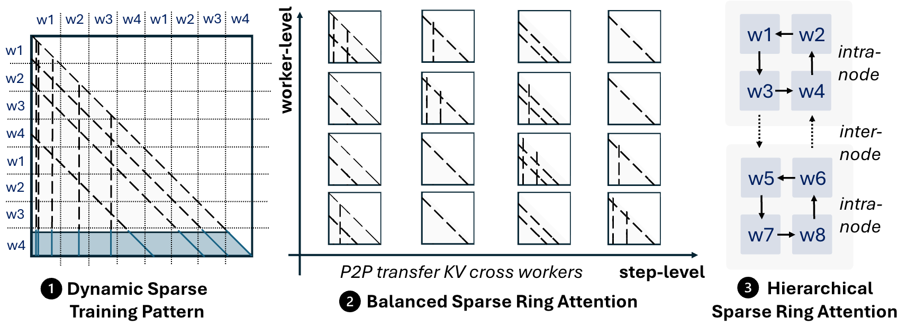

# MTraining

[[Paper]](https://arxiv.org/abs/2510.18830)




MTraining is the dynamic-sparse-attention-based long-context training strategy. Its implementation builds on top of nnScaler and provides:

- training-time sparse attention integration for ultra-long context LLMs,
- distributed sparse attention operators (implemented in `minference/dist_ops`),
- example scripts for data preparation and training in `mtraining/experiments/scripts`.


## Installation

Use the setup script to install dependencies and build from source:

```bash
cd mtraining
bash setup.sh
```

`setup.sh` will:

- install pinned training dependencies (including nnScaler and FlashAttention variants),
- install `MInference` from source (`pip install -e .`) and then `mtraining` in editable mode.


## Operator Correctness Tests

From repository root:

```bash
# Run ring sparse attention tests
bash minference/dist_ops/test/run_ring_pytests.sh
```

Or run tests individually:

```bash
pytest -s minference/dist_ops/test/minfer_ring_test.py
pytest -s minference/dist_ops/test/moba_ring_test.py
pytest -s minference/dist_ops/test/xattn_ring_test.py
```


## Quick Start: Data Preparation + Training

### 1) Prepare ProLong 512K data

```bash
cd mtraining
bash experiments/scripts/prolong_data_prepare.sh
```

This script downloads `princeton-nlp/prolong-data-512K` in `RAW_DATASET_DIR/long-context-524288` (~228G) and pre-processes it to `PROCESSED_DATA_DIR` (~19G) by data sampling (default interval: 4) and re-tokenization.


### 2) Launch training

We have provided sample training script in `mtraining/experiments/scripts` for training Qwen-2.5 models (0.5B and 3B) with or without sparse attention. For example, `mtraining/experiments/scripts/train_qwen2_3B_ProLong512K.sh` is to train Qwen-2.5-3B with MTraining under Striped Ring Attention.

You can adjust the type of the attention operator to be used during the training, where the supported `--attn_type` values include:

- `dense`
- `zigzag_ring`
- `stripe_ring`
- `minfer`
- `moba`
- `xattn`

where `minfer` refer to our dynamic sparse attention operators. You may need to further configure the selected attention by giving a `yaml`-based configuration. The directory `mtraining/train_attn_configs` has provided a set of such configurations. For example, `mtraining/train_attn_configs/qwen_flex_090.yaml` is like below:

```yaml
pattern_config_name: Qwen2.5_3B_flex_0.90
implementation: stripe
```

which specifies the sparse pattern file under `minference/configs` and the usage of striped Ring Attention. The field `implementation` can be `zigzag`, `stripe` and `dr_stripe`, corresponding to Zigzag, Striped and Hierarchical Striped Ring Attention respectively.


## Citation

If you use MTraining, please cite:

```bibtex
@article{li2025mtraining,
  title={MTraining: Distributed Dynamic Sparse Attention for Efficient Ultra-Long Context Training},
  author={Li, Wenxuan and Zhang, Chengruidong and Jiang, Huiqiang and Li, Yucheng and Yang, Yuqing and Qiu, Lili},
  journal={arXiv preprint arXiv:2510.18830},
  year={2025}
}
```
